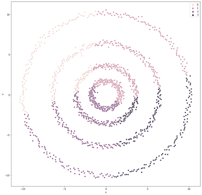
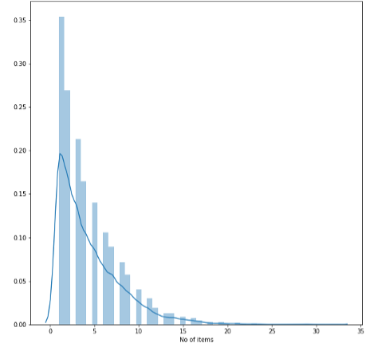
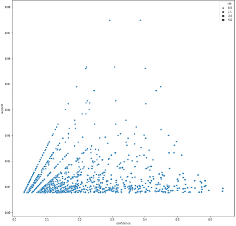

# Machine Learning

The term Machine Learning was coined by Arthur L. Samuel (1901 – 1990) in his 1959 paper. It's a field of study that gives computers the ability to learn without being explicitly programmed. A computer program is said to learn from experience E with respect to some task T and some performance measure P, if its performance on T, as measured by P, improves with experience E.

In this project I tend to cover the the use of machine learning for different projects I do in school and work. 

## Objectives

1. Association Rules
2. Clustering*
3. Decision Trees
4. Multinomial Logistic Regression*
5. Feature Selection
6. Naïve Bayes
7. Neural Networks*
8. Support Vector Machines
9. Gradient Boosting
10. Memory Based Learner

After you have imported the CSV files, please discover association rules using this dataset. For your information, the observations have been sorted in ascending order by Customer and then by Item. Also, duplicated items for each customer have been removed.

Create a data frame that contains the number of unique items in each customer’s market basket. Draw a histogram of the number of unique items. Study the 25th, 50th, and the 75th percentiles of the histogram.

Apply the K-mean algorithm directly using your number of clusters that you think in (a). Regenerate the scatterplot using the K-mean cluster identifiers to control the color scheme. Please comment on this K-mean result.

Find out the association rules whose Confidence metrics are greater than or equal to 1%. Please be reminded that a rule must have a non-empty antecedent and a non-empty consequent. Total number of association rules should be 1200. After that plot the Support metrics on the vertical axis against the Confidence metrics on the horizontal axis for the rules you have found. Use the Lift metrics to indicate the size of the marker.
